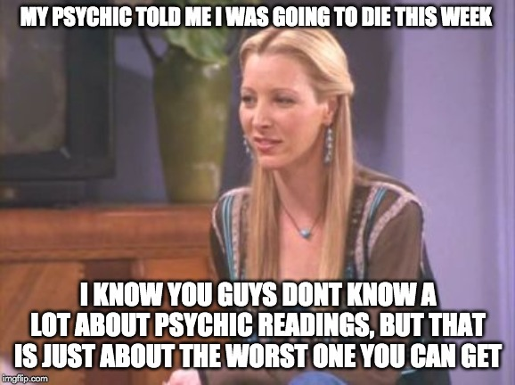

# friends
An analysis of the sitcom F.R.I.E.N.D.S

|                                                         |   |
|---                                                      |---|
|  My aim was to see whether I could build a model that predicts who said what lines. I would then tes this against the Bayes Error (in this case are my Friends obsessed friends).

For this is converted the text into cvec and tf-idf, looked at word length, season, grammar and tried a number of models.

The best score I obtained was xx using xx model.

Then talk about features… e.g. did it predict Joey saying ‘How you doing” or Ross talking about dinosaurs?
                                                       
                                                       
                                                       |  |
|   |   |

